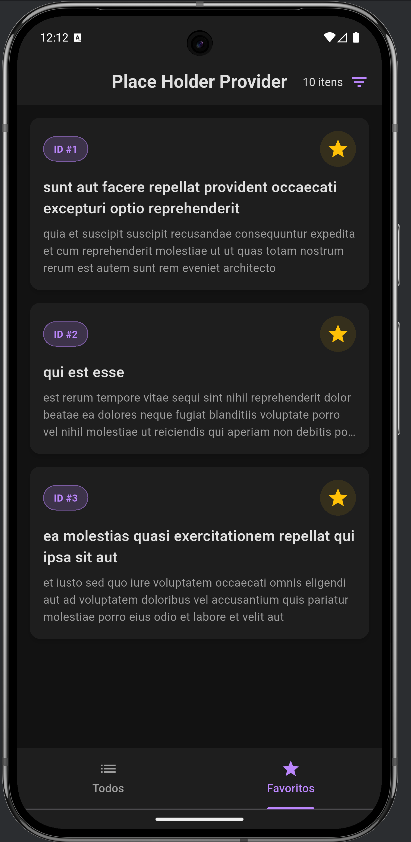

# 📱 Place Holder App

Um aplicativo Flutter robusto desenvolvido para demonstração de consumo de API REST, gerenciamento de estado e arquitetura limpa. O projeto consome dados da [JSONPlaceholder API](https://jsonplaceholder.typicode.com/) para exibir, filtrar e detalhar postagens.


---

## 📸 Screenshots

<p align="center">
  
  
  
  
</p>

---

## ✨ Funcionalidades

- **Consumo de API REST:** Integração completa com métodos HTTP (GET).
- **Gerenciamento de Estado (Provider):** Separação total entre lógica de negócio e interface (UI).
- **Tratamento de Erros Robusto:**
  - Tratamento visual para falta de conexão (SocketException).
  - Feedback amigável para Timeouts e Erros de Servidor (404/500).
  - Botão de "Tentar Novamente" (Retry Policy).
- **Favoritos Locais:** Capacidade de marcar/desmarcar posts como favoritos (Runtime State).
- **Filtro de Quantidade:** Controle dinâmico do limite de itens buscados na API.
- **UI/UX Sofisticada:**
  - Tema escuro (Dark Mode) com paleta de cores premium.
  - Animações **Hero** na transição entre lista e detalhes.
  - Layout responsivo com tratamento de *overflow*.

---

## 🏗️ Arquitetura e Padrões

O projeto segue o padrão arquitetural **MVVM (Model-View-ViewModel)** adaptado para Flutter com o pacote **Provider**.

### Estrutura de Pastas

lib/ ├── models/ # DTOs (Data Transfer Objects) - O formato dos dados │ └── post_item.dart ├── providers/ # ViewModels - Gerenciamento de Estado e Lógica de Negócio │ └── post_provider.dart ├── services/ # Data Source - Comunicação externa (HTTP) │ └── post_service.dart ├── screens/ # Views - Apenas a camada visual (Widgets) │ ├── todo_page.dart │ └── post_details_page.dart └── main.dart # Injeção de Dependência e Inicialização


### Fluxo de Dados

1.  **View (`todo_page.dart`):** Solicita uma ação (ex: `provider.loadPosts()`) e "escuta" mudanças.
2.  **ViewModel (`post_provider.dart`):** Gerencia o estado (`isLoading`, `posts`, `error`) e chama o serviço.
3.  **Service (`post_service.dart`):** Executa a requisição HTTP bruta e trata exceções de rede.
4.  **Model (`post_item.dart`):** Define a estrutura do objeto JSON recebido.

---

## 🛠️ Tecnologias Utilizadas

- **[Flutter](https://flutter.dev/):** SDK do Google para criação de interfaces nativas.
- **[Dart](https://dart.dev/):** Linguagem otimizada para UI.
- **[Provider](https://pub.dev/packages/provider):** Injeção de dependência e gerenciamento de estado reativo.
- **[Http](https://pub.dev/packages/http):** Para realizar requisições de rede.

---

## 🚀 Como Rodar o Projeto

Pré-requisitos: Tenha o Flutter instalado e configurado na sua máquina.

1. **Clone o repositório:**
   ```bash
   git clone [https://github.com/SEU_USUARIO/place_holder.git](https://github.com/wyllamcoelhoads/place_holder_app.git)

Entre na pasta do projeto:cd place_holder
Instale as dependências:flutter pub get
Execute o App: flutter run

📝 Próximos Passos (Roadmap)
[ ] Implementar persistência de dados local (SQLite ou SharedPreferences) para salvar favoritos offline.

[ ] Adicionar funcionalidade de busca por texto.

[ ] Implementar testes unitários para o post_service.dart.

Desenvolvido com 💜 por William da Silva.